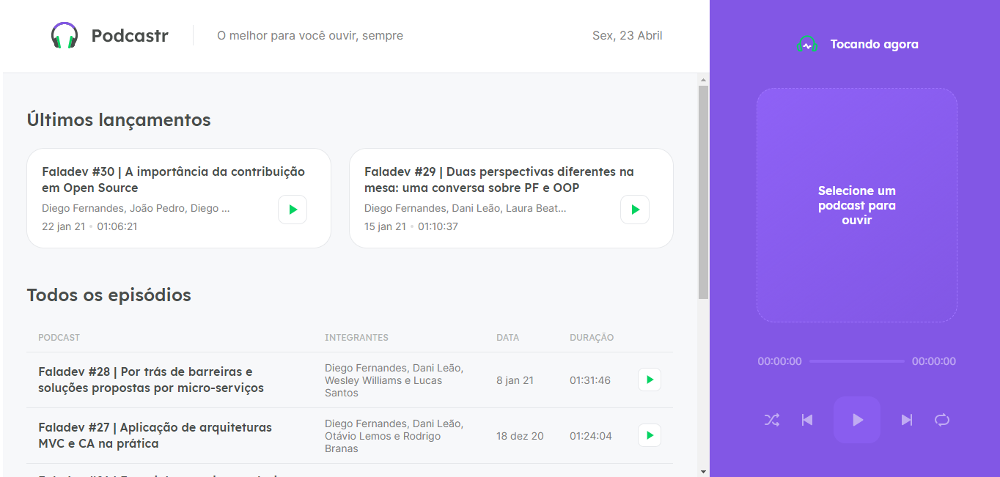
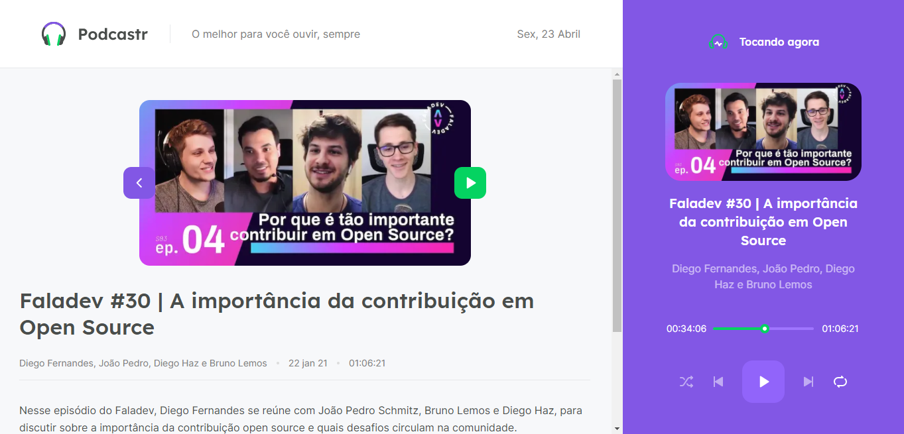

<h1  align="center"></h1>

<p></p>

### 🏠 [Veja aqui a aplicação em ação!]()

> 🎧 Podcastr - O melhor para você ouvir, sempre


<p align="center">
 <a href="#overview">Overview</a> •
 <a href="#demonstracao">Demonstração</a> •
 <a href="#comousar">Como usar</a> •
 <a href="#tecnologias">Tecnologias</a> • 
 <a href="#autora">Autora</a>
</p>

<h2 id="overview">✨ Overview</h2>

<p>
  A aplicação foi desenvolvida durante a trilha React.js da Next Level Week #5 promovida pela Rocketseat. 🚀 
  Após o término da NLW, por conta própria, deixei a aplicação responsiva e arrumei alguns detalhes do estilo, principalmente nas imagens.
</p>

<h2 id="demonstracao">🖱 Demonstração</h2>

<p>'
  
  
</p>

<h2 id="comousar">⚒️ Como usar</h2>

<h3>Instalação</h3>
  <p>Clone esse projeto</p>

   ```sh

  git clone https://github.com/luizaacampos/podcastr-nlw5.git
  
```
<p>Com o projeto aberto execute o comando abaixo no terminal do seu editor de código ou computador.

  ```sh

yarn

```

<h3>Rodando a aplicação</h3>
  <p>No terminal execute o comando abaixo.</p>

```sh

yarn dev

```

<p>A aplicação será aberta na porta:3000. No seu navegador acesse http://localhost:3000</p>


<h2 id="tecnologias">🛸 Tecnologias</h2>
  
  <p>
    As seguintes ferramentas foram usadas no desenvolvimento dessa aplicação:
    <ul>
      <li><a href="https://pt-br.reactjs.org/">React.js</a></li>
      <li><a href="https://nextjs.org/">Next.js</a></li>
      <li><a href="https://www.typescriptlang.org/">TypeScript</a></li>
      <li><a href="https://sass-lang.com">Sass</a></li>
    </ul>
  </p>

  <h2 id="autora">👤 Autora</h2>

<h3>Desenvolvido com 💖 por Luiza Campos</h3>

* [Linkedin](https://linkedin.com/in/luiza-de-almeida-campos)
* [Github](https://github.com/luizaacampos)


<strong align="center">Não esqueça de deixar sua ⭐️</strong>

  